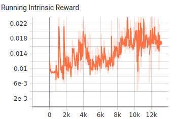

[](http://makeapullrequest.com)  
# Random Network Distillation

> Visit [RNN_Policy branch](https://github.com/alirezakazemipour/PPO-RND/tree/RNN_Policy) for RNN Policy implementation instead of CNN Policy.

Implementation of the **Exploration by Random Network Distillation** on Montezuma's Revenge Atari game. The algorithm is simply consists of generating intrinsic rewards based on the novelty that agent faces and using these rewards to reduce the sparsity of the game. The main algorithm to train the agent is **Proximal Policy Optimization** that is able to combine extrinsic and intrinsic rewards easily and has fairly less variance during training.

## Demo

RNN Policy| CNN Policy
:-----------------------:|:-----------------------:|
| 

## Results
RNN Policy| CNN Policy
:-----------------------:|:-----------------------:|
	               | 	
      | 
| 

## Important findings to mention

- **As it has been mentioned in the paper**, one of the obstacles that impact seriously the performance of the agent is the **Dancing with Skulls**. During the test time and also by observing the Running Intrinsic Reward during the training time, it got clear that most of the time, the agent is extremely willing to play with skulls, spiders, laser beams and etc. since those behaviors produce considerable intrinsic rewards.
- `Kernel_size` of [this part](https://github.com/openai/random-network-distillation/blob/f75c0f1efa473d5109d487062fd8ed49ddce6634/policies/cnn_policy_param_matched.py#L104) of the original implementation is wrong; it should be 3 (same as the DQN nature paper) but it is 4.
- The usage of `RewardForwardFilter` in the original implementation is definitely wrong, as it's been addressed [here](https://github.com/openai/large-scale-curiosity/issues/6#issuecomment-433981760) and solved [here](https://github.com/openai/random-network-distillation/issues/16#issuecomment-488387659)

## Table of hyper-parameters

> By using the max and skip frames of 4, max frames per episode should be 4500 so 4500 * 4 = 18000 as it has been mentioned in the paper.

Parameters          | Value
:-----------------------:|:-----------------------:|
total rollouts per environment  | 30000
max frames per episode  | 4500
rollout length       	       | 128
number of evnvironments| 128
number of epochs	   | 4
number of mini batches  | 4
learning rate                      | 1e-4
extrinsic gamma		    | 0.999
extrinsic gamma		    | 0.99
lambda		                  | 0.95
extrinsic advantage coefficient       | 2
intrinsic advantage coefficient        | 1
entropy coefficient     		    | 0.001
clip range    				       | 0.1
steps for initial normalization	      | 50
predictor proportion		     | 0.25


## Structure
```shell
├── Brain
│   ├── agent.py
│   └── model.py
├── Common
│   ├── config.py
│   ├── logger.py
│   ├── play.py
│   └── utils.py
├── main.py
├── Memory
│   ├── replay_memory.py
│   └── segment_tree.py
├── README.md
├── requirements.txt
└── Results
    ├── 10_last_mean_reward.png
    ├── rainbow.gif
    └── running_reward.png
```
1. _Brain_ dir consists the neural network structure and the agent decision making core.
2. _Common_ consists minor codes that are common for most RL codes and do auxiliary tasks like: logging, wrapping Atari environments and ... .
3. _main.py_ is the core module of the code that manges all other parts and make the agent interact with the environment.
4. _Memory_ consists memory of the agent with prioritized experience replay extension.
## Dependencies
- gym == 0.17.2
- numpy == 1.19.1
- opencv_contrib_python == 3.4.0.12
- psutil == 5.4.2
- torch == 1.4.0

## Installation
```shell
pip3 install -r requirements.txt
```
## Usage
### How to run
```bash
main.py [-h] [--algo ALGO] [--mem_size MEM_SIZE] [--env_name ENV_NAME]
               [--interval INTERVAL] [--do_train] [--train_from_scratch]
               [--do_intro_env]

Variable parameters based on the configuration of the machine or user's choice

optional arguments:
  -h, --help            show this help message and exit
  --algo ALGO           The algorithm which is used to train the agent.
  --mem_size MEM_SIZE   The memory size.
  --env_name ENV_NAME   Name of the environment.
  --interval INTERVAL   The interval specifies how often different parameters
                        should be saved and printed, counted by episodes.
  --do_train            The flag determines whether to train the agent or play
                        with it.
  --train_from_scratch  The flag determines whether to train from scratch or[default=True]
                        continue previous tries.
  --do_intro_env        Only introduce the environment then close the program.
```
- **In order to train the agent with default arguments , execute the following command and use `--do_train` flag, otherwise the agent would be tested** (You may change the memory capacity and the environment based on your desire.):
```shell
python3 main.py --algo="rainbow" --mem_size=150000 --env_name="PongNoFrameskip-v4" --interval=100 --do_train
```
- **If you want to keep training your previous run, execute the follwoing:**
```shell
python3 main.py --algo="rainbow" --mem_size=150000 --env_name="PongNoFrameskip-v4" --interval=100 --do_train --train_from_scratch
```
### Hardware requirements
- **The whole training procedure was done on Google Colab and it took less than 15 hours of training, thus a machine with similar configuration would be sufficient, but if you need a more powerful free online GPU provider, take a look at [paperspace.com](paperspace.com)**.
## References
1. [_Human-level control through deep reinforcement learning_, Mnih et al., 2015](https://www.nature.com/articles/nature14236)
2. [_Deep Reinforcement Learning with Double Q-learning_, Van Hasselt et al., 2015](https://arxiv.org/abs/1509.06461)
3. [_Dueling Network Architectures for Deep Reinforcement Learning_, Wang et al., 2015](https://arxiv.org/abs/1511.06581)
4. [_Prioritized Experience Replay_, Schaul et al., 2015](https://arxiv.org/abs/1511.05952)
5. [_A Distributional Perspective on Reinforcement Learning_, Bellemere et al., 2017](https://arxiv.org/abs/1707.06887)
6. [_Noisy Networks for Exploration_, Fortunato et al., 2017](https://arxiv.org/abs/1706.10295)
7. [_Rainbow: Combining Improvements in Deep Reinforcement Learning_, Hessel et al., 2017](https://arxiv.org/abs/1710.02298)
## Acknowledgement 
1. [@Curt-Park](https://github.com/Curt-Park) for [rainbow is all you need](https://github.com/Curt-Park/rainbow-is-all-you-need).
2. [@higgsfield](https://github.com/higgsfield) for [RL-Adventure](https://github.com/higgsfield/RL-Adventure).
3. [@wenh123](https://github.com/wenh123) for [NoisyNet-DQN](https://github.com/wenh123/NoisyNet-DQN).
4. [@qfettes](https://github.com/qfettes) for [DeepRL-Tutorials](https://github.com/qfettes/DeepRL-Tutorials).
5. [@AdrianHsu](https://github.com/AdrianHsu) for [breakout-Deep-Q-Network](https://github.com/AdrianHsu/breakout-Deep-Q-Network).
6. [@Kaixhin](https://github.com/Kaixhin) for [Rainbow](https://github.com/Kaixhin/Rainbow).
7. [@Kchu](https://github.com/Kchu) for [DeepRL_PyTorch](https://github.com/Kchu/DeepRL_PyTorch).
